# Firebase Flutter Codelab

## Langkah Praktikum 

### 1. Menjalankan sampel kode

Berikut ini menjalankan sampel kode dari **codelab**.

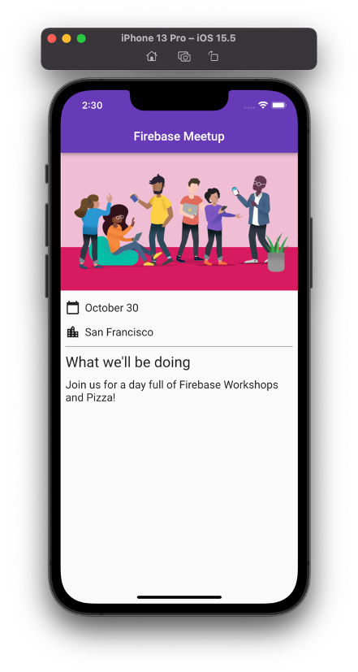

### 2. Melakukan setup project Firebase

- Memberi nama project firebase

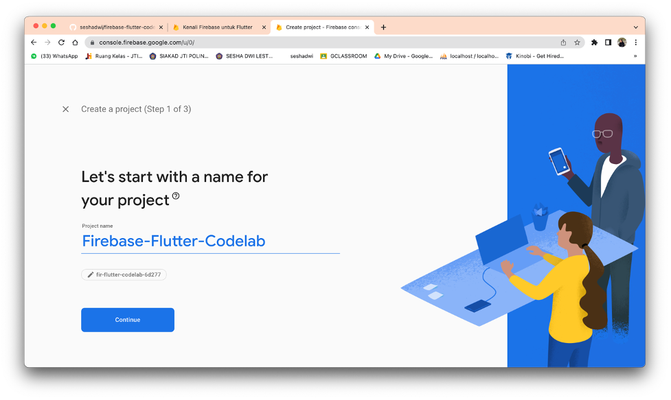

- Menonaktifkan **Google Analytics**

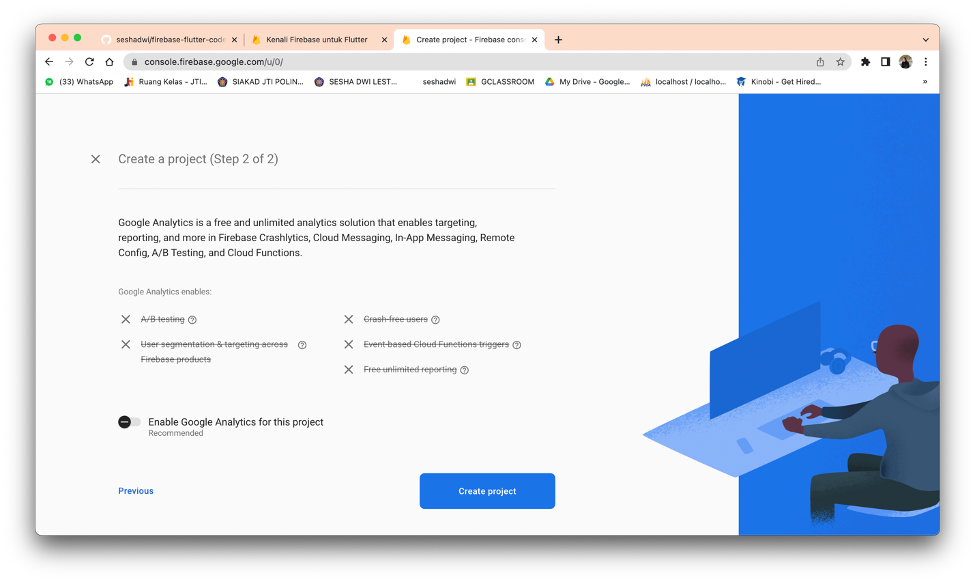

- Mengaktifkan login email untuk **Firebase Authentication**

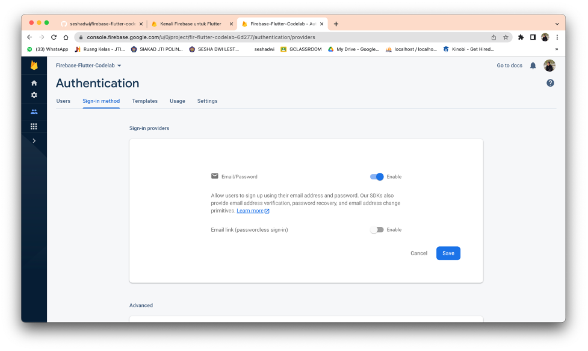

- Mengaktifkan **Cloud Firestore**

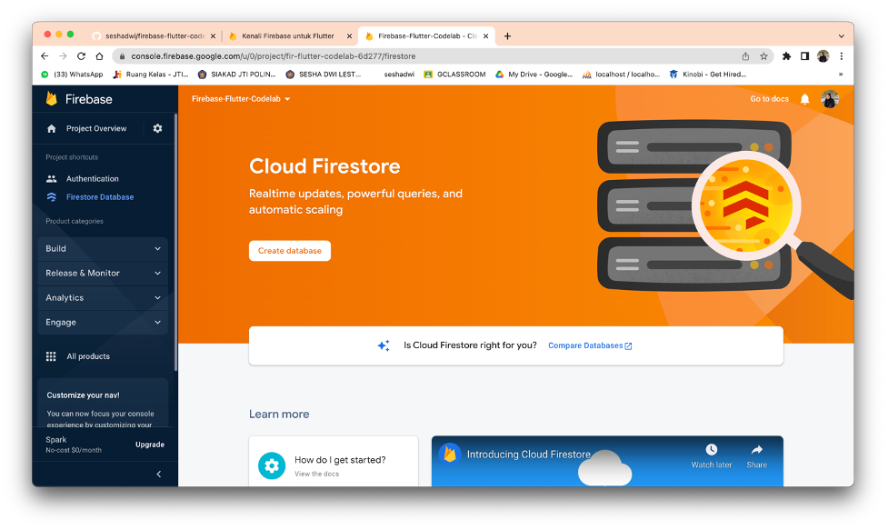

- Pilih opsi **test mode**

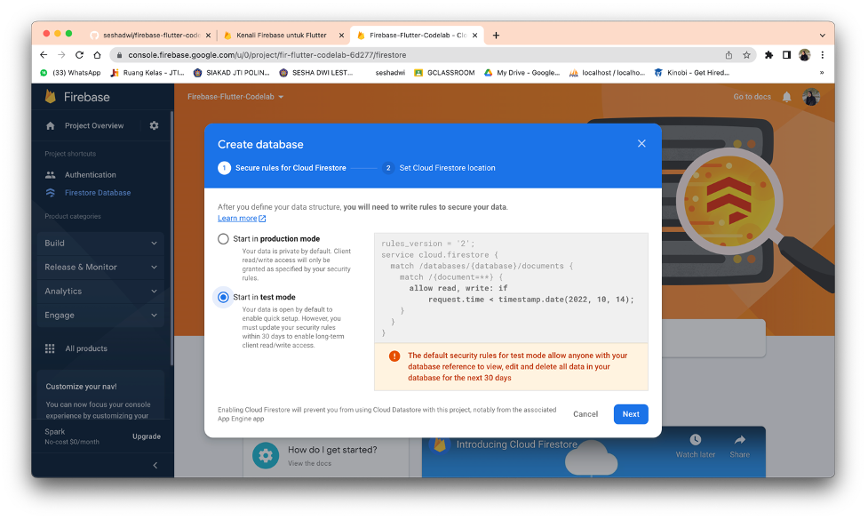

- Pilih **Firestore location**

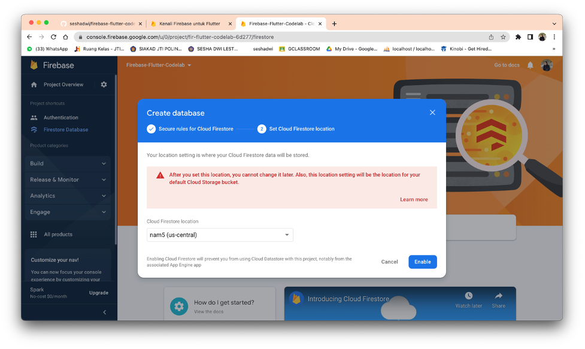

- Lalu klik **enable** untuk mengaktifkan

### 3. Mengkonfigurasi Firebase

- Mengkonfigurasi dependensi

  Menjalankan perintah berikut pada terminal

  `flutter pub add firebase_core` digunakan untuk plugin **Firebase Flutter**.

  `flutter pub add firebase_auth` mengintegrasikan **Otentikasi Firebase**.

  `flutter pub add cloud_firestore` mengakses penyimpanan data **Cloud Firestore**.

  `flutter pub add provider` digunakan untuk utilisasi Firebase. 

- Menginstall Flutterfire

  **Flutter CLI** merupakan sebuah interface baris perintah pada flutter yang digunakan untuk mengkonfigurasi project untuk mengintegrasikan pada Firebase. Menjalankan perintah berikut pada terminal. 

  `dart pub global activate flutterfire_cli`. 

- Mengkonfigurasi Apps

  Untuk melakukan konfigurasi app, dapat menggunakan perintah `flutterfire configure` pada terimal.

- Konfigurasi macOS

  Menambahkan baris program berikut pada direktori **macos/Runner/DebugProfile.entitlements**.

  ```
  <key>com.apple.security.network.client</key>
  <true/>
  ```

  Menambahkan baris program berikut pada direktori **macos/Runner/Release.entitlements**.

  ```
  <key>com.apple.security.network.client</key>
  <true/>
  ```

### 4. Menambahkan **user sign-in** (RSVP)

Berikut ini hasil penambahan **user sign-in** pada kode program 

  1) Menekan tombol RSVP


  2) Memasukkan email yang ingin didaftarkan

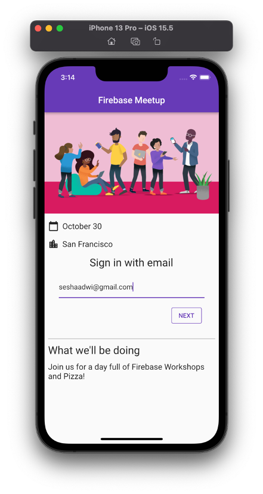

  3) Memasukkan password, apabila kurang dari 6 karakter maka akan muncul pesan error.


  4) Setelah semua terisi, untuk melanjutkan klik **SAVE**.

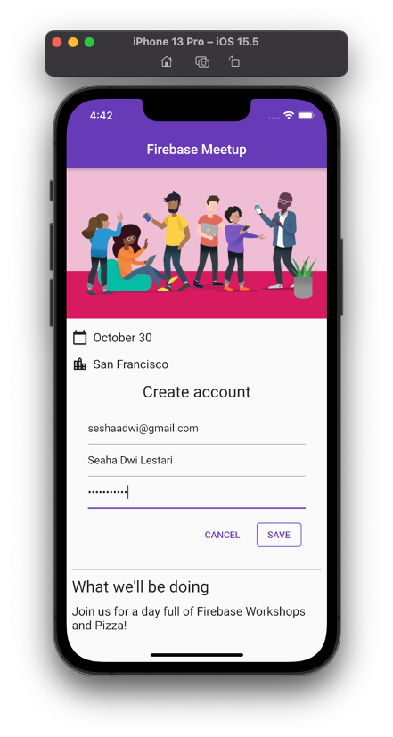

  5) Apabila berhasil maka akan muncul button **LOGOUT** sebagai berikut.

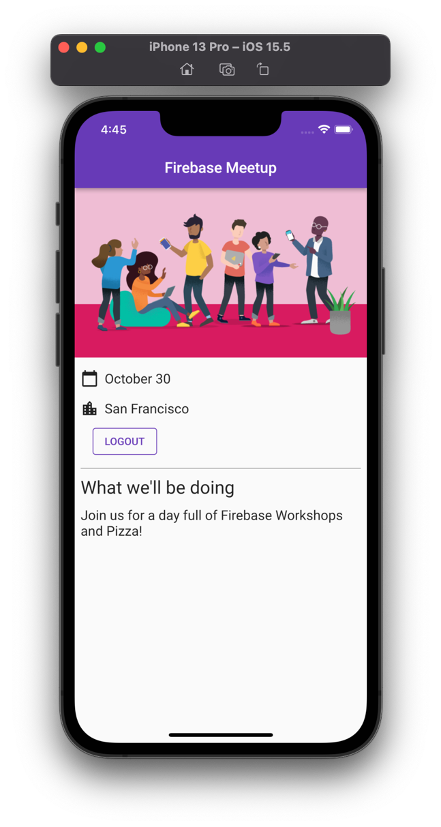

### 5. Menulis Pesan ke Cloud Firestore

  Hasil praktikum sebagai berikut
  
  1) Penambahan button **SEND** Pada screen.


  2) Menambahkan sebuah pesan baru.

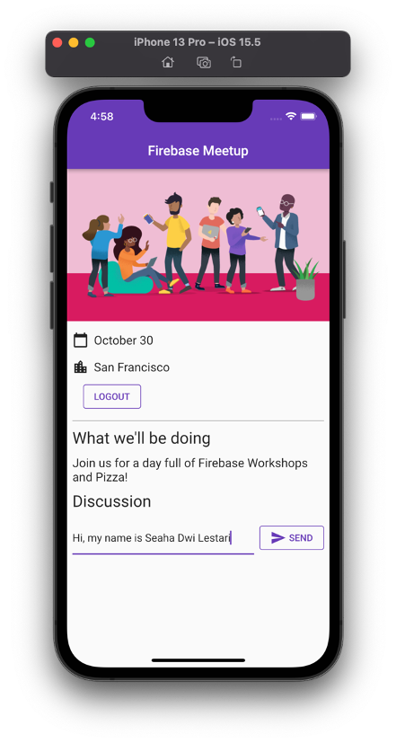

  3) Pesan berhasil disimpan pada **Cloud Firebase**.


### 6. Membaca Pesan

  Berikut merupakan hasil praktikum penerapan pembacaan pesan pada Firebase. 
  


### 7. Menyiapkan aturan keamanan dasar 

  Menambahkan beberapa validasi sehingga hanya pengguna yang masuk yang dapat membaca pesan (pesan apa pun), tetapi hanya pembuat pesan yang dapat mengedit pesan.
  
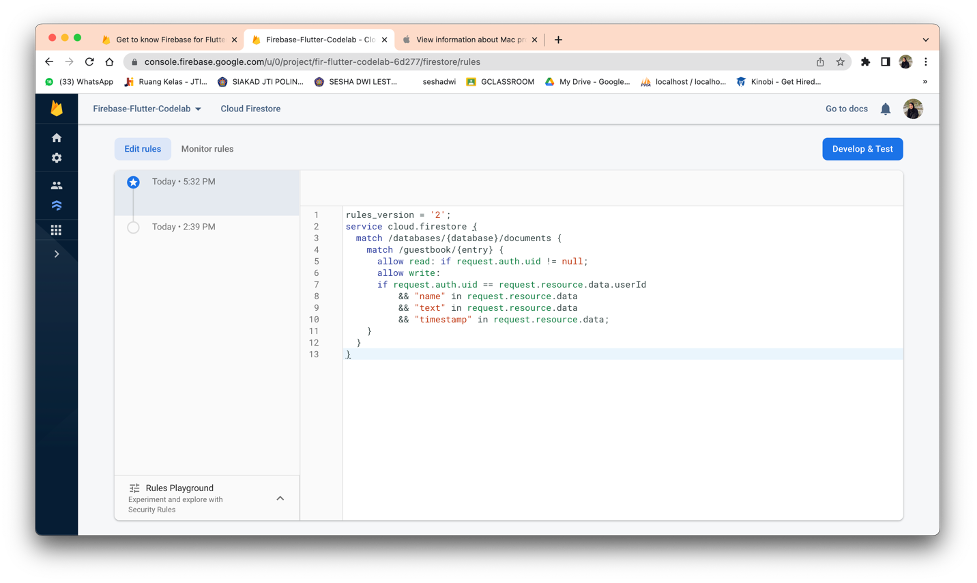

### 8. Mencatat status RSVP peserta 

  Menambahkan validasi berikut untuk mengizinkan semua orang membaca daftar peserta (karena tidak ada data pribadi di sana), tetapi hanya pembuatnya yang dapat memperbaruinya. 

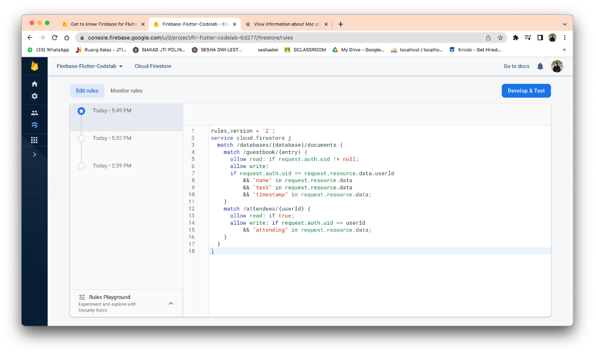

  Hasil praktikum

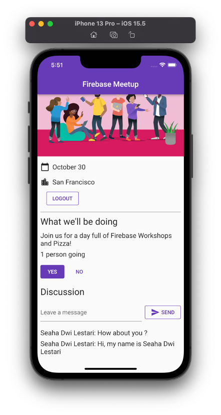
