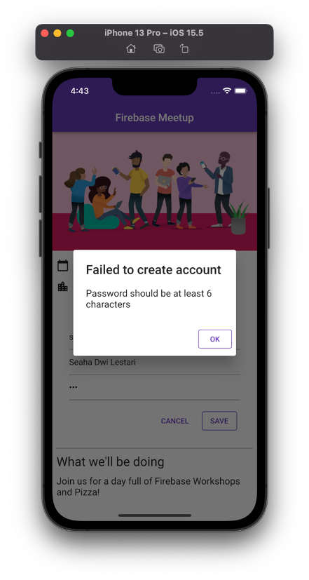
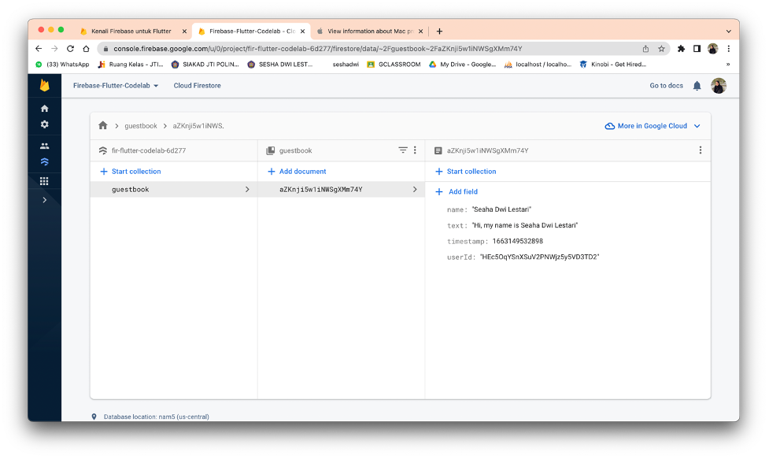
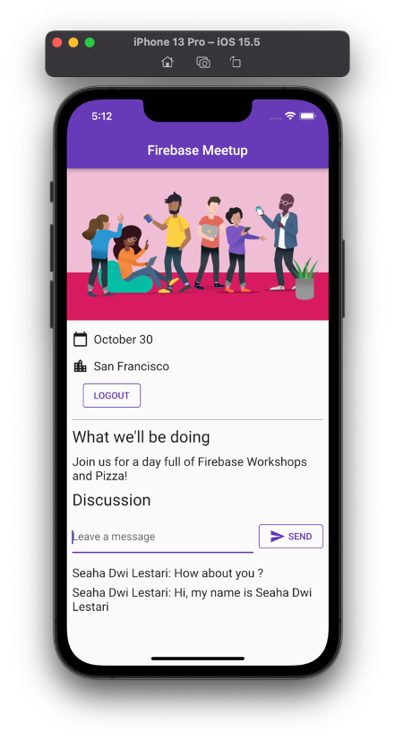

# Firebase Flutter Codelab

## Langkah Praktikum 

### 1. Menjalankan sampel kode

Berikut ini menjalankan sampel kode dari **codelab**.


### 2. Melakukan setup project Firebase

- Memberi nama project firebase


- Menonaktifkan **Google Analytics**


- Mengaktifkan login email untuk **Firebase Authentication**


- Mengaktifkan **Cloud Firestore**


- Pilih opsi **test mode**


- Pilih **Firestore location**


- Lalu klik **enable** untuk mengaktifkan

### 3. Mengkonfigurasi Firebase

- Mengkonfigurasi dependensi

  Menjalankan perintah berikut pada terminal

  `flutter pub add firebase_core` digunakan untuk plugin **Firebase Flutter**.

  `flutter pub add firebase_auth` mengintegrasikan **Otentikasi Firebase**.

  `flutter pub add cloud_firestore` mengakses penyimpanan data **Cloud Firestore**.

  `flutter pub add provider` digunakan untuk utilisasi Firebase. 

- Menginstall Flutterfire

  **Flutter CLI** merupakan sebuah interface baris perintah pada flutter yang digunakan untuk mengkonfigurasi project untuk mengintegrasikan pada Firebase. Menjalankan perintah berikut pada terminal. 

  `dart pub global activate flutterfire_cli`. 

- Mengkonfigurasi Apps

  Untuk melakukan konfigurasi app, dapat menggunakan perintah `flutterfire configure` pada terimal.

- Konfigurasi macOS

  Menambahkan baris program berikut pada direktori **macos/Runner/DebugProfile.entitlements**.

  ```
  <key>com.apple.security.network.client</key>
  <true/>
  ```

  Menambahkan baris program berikut pada direktori **macos/Runner/Release.entitlements**.

  ```
  <key>com.apple.security.network.client</key>
  <true/>
  ```

### 4. Menambahkan **user sign-in** (RSVP)

Berikut ini hasil penambahan **user sign-in** pada kode program 










